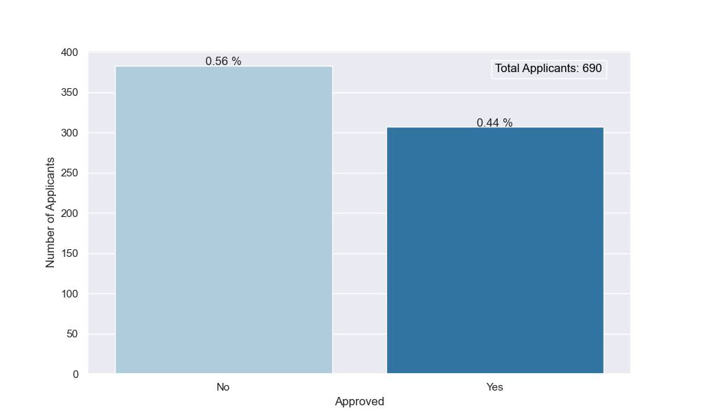
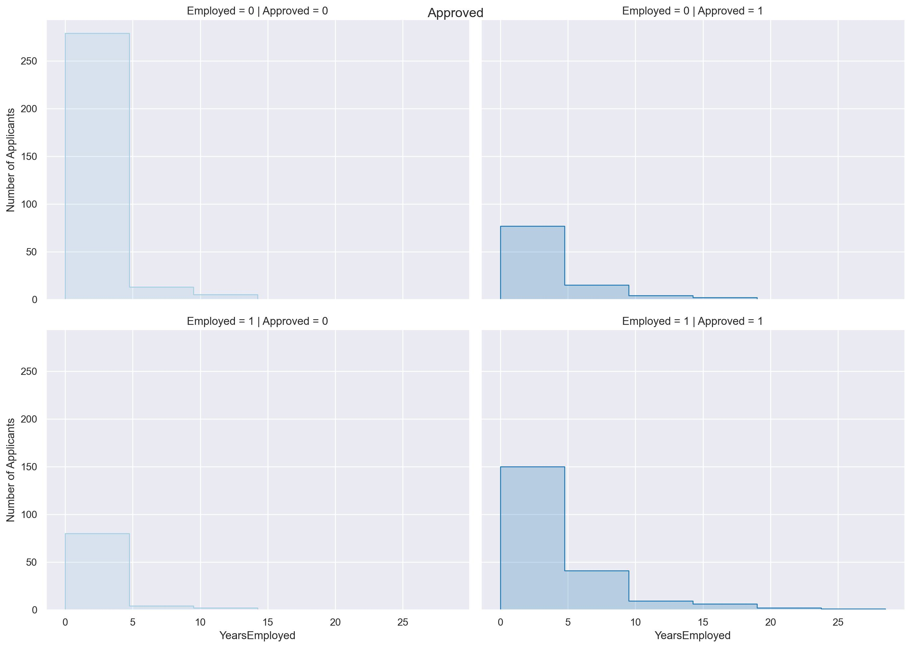
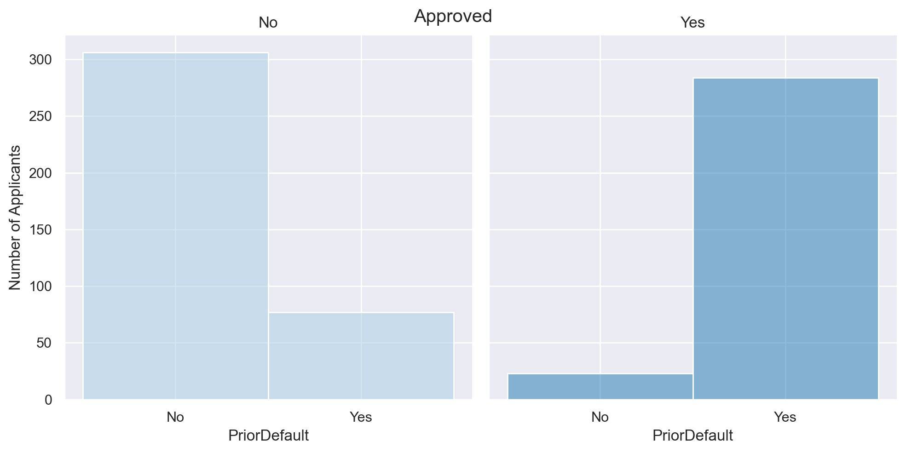
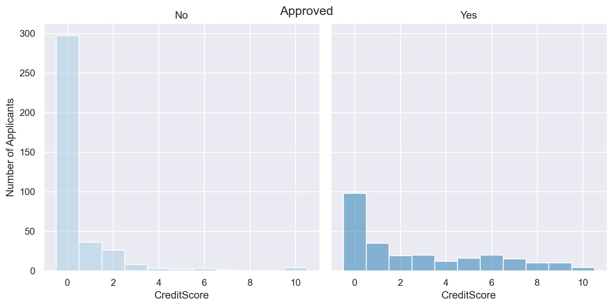

# Apply and get approved for a credit card.
Applying for a credit card and waiting for approval or denial can feel as scary as taking a final exam or giving a public speech. 

Knowing how to apply for a credit card is one thing. Still, knowing what issuers are looking for _before_ you apply for a new card is the first step to success in this credit card hunting. 

We studied __690__ applications and found some interesting insights so you can prepare better before applying for your new credit card.

The rate of approvals and denials was very close for our random sample of applicants. 

Exactly __307__ credit card applications were approved.

With the information that we gathered from each applicant, we found a correlation between some factors.

For example, We can see that you have better chances of getting your application approved if you are currently employed and have been working for a few years. In contrast to those who are not employed.

Interestingly, we can notice that having a prior default will not affect the approval of your credit card application. We can see roughly the same amount of applications being denied for having a prior default and applications being approved when having a prior default.

In contrast, we can see that even if you have a bad credit score, you still have the opportunity to get your credit card application approved. The reason is that these people are currently employed at the comment of applying for a new credit card.

In conclusion, The first step to applying for a credit card is to determine what type of card you need in the first place. Then, knowing your credit scores and what's on your credit reports can help you determine what products to apply for. If you have fair credit, for example, you may not want to apply for a card that clearly states that only applicants with excellent credit will be approved. Finally, It is recommended that you are currently employed when applying. 